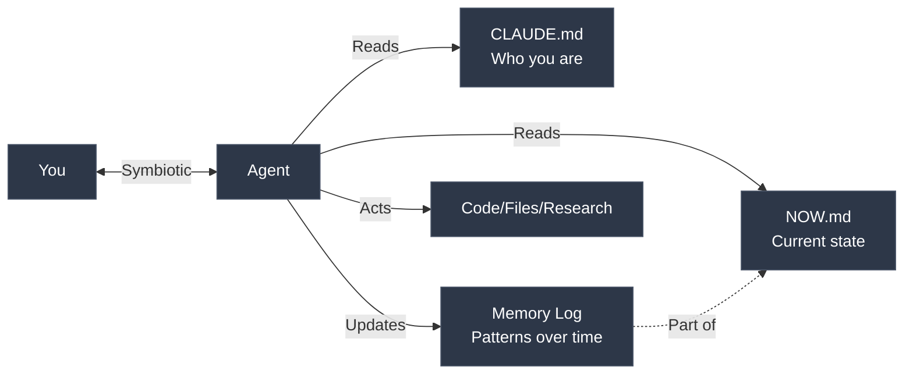

# Claude Life Assistant

A symbiotic AI agent that remembers everything, acts autonomously, and extends your cognition.

<a href="https://www.youtube.com/watch?v=cY3LvkB1EQM"></a>
    
[Watch the video](https://www.youtube.com/watch?v=cY3LvkB1EQM)

## What This Is

A 2-file system that turns Claude into a symbiotic agent:
- **Memory** — Persistent context across all sessions
- **Autonomy** — Acts directly (code, files, research)
- **Coordination** — Reads your identity, tracks your state, notices patterns

**The key difference:** Not a chatbot. An agent that lives in your filesystem, remembers your context, and operates alongside you.

## How It Works



**The Philosophy:** Symbiotic AI through transparency. All memory lives in files you control. The agent builds context over time, acts autonomously, and you see everything it remembers.

## Installation

**One command:**

```bash
curl -fsSL https://raw.githubusercontent.com/lout33/claude_life_assistant/main/install.sh | bash
```

Works with Claude Code, OpenCode, or as a local project. The script auto-detects your setup.

**Windows users:** Run in WSL or Git Bash.

### Manual Installation

**Option 1: Clone**

```bash
git clone https://github.com/lout33/claude_life_assistant
cd claude_life_assistant
```

Then open with Claude Code and start talking.

**Option 2: Global Install (Claude Code)**

```bash
cp CLAUDE.md NOW.md ~/.claude/
mkdir -p ~/.claude/commands
cp -r commands/* ~/.claude/commands/
```

**Option 3: Global Install (OpenCode)**

```bash
cp CLAUDE.md ~/.config/opencode/AGENTS.md
cp NOW.md ~/.config/opencode/
mkdir -p ~/.config/opencode/command
cp -r commands/* ~/.config/opencode/command/
```

## Quick Start

After install, just start talking. The agent learns about you through conversation.

Use `/sync` to check in anytime. The agent adapts based on time of day:
- **Morning** — "What would make today a win?"
- **Midday** — "What are you doing right now?"
- **Evening** — "What happened today?"

One command. The agent infers the rest from your response.

## The 2-File System

| File | Updates | Purpose |
|------|---------|---------|
| `CLAUDE.md` | Rarely (weeks/months) | Who you are, how you work, your mission |
| `NOW.md` | Daily/weekly | Current mode, this week's actions, Memory Log |
| `archive/` | Weekly/monthly | Historical snapshots (optional) |

**Why 2 files?**

Separation = clarity. CLAUDE.md is your operating system. NOW.md is your current state. Claude reads both at session start, updates NOW.md as you work.

**Conversation > Documentation**

You talk. The agent acts and maintains the files. No manual editing required (though you can if you want).

## How It Works (Data Flow)

**Local:**
- All your files (`CLAUDE.md`, `NOW.md`, `archive/`) are stored on your machine
- You own and control all data
- Safe to version control (but consider `.gitignore` for personal files)

**Cloud:**
- Conversations are processed through your AI provider's API (Anthropic, OpenAI, etc.)
- API usage costs apply based on your provider's pricing
- Your provider's privacy policy applies to conversation data

**Want full privacy?** This file-based system works with any LLM. For local-only processing, use with Ollama or LM Studio (setup instructions coming soon).

## The Memory Log (Secret Sauce)

In `NOW.md`, the agent maintains a dated log:
- Patterns it notices over time
- Your exact words (quoted)
- Breakthroughs and insights
- Connections across conversations

**This is what makes it symbiotic, not just a journal.** The agent sees patterns you miss, remembers what you forget, and acts on context you'd lose between sessions.

Example progression:
```
### Week 1, Jan 7
- Setup complete. Known bug: 'I keep adding features instead of launching'

### Week 1, Jan 10
- Avoided user call. Rescheduled twice. Pattern: building = safe, talking = scary.

### Week 2, Jan 15
- Had first user call. Quote: 'I've been building what I think they want instead of asking'

### Week 4, Feb 1
- Pattern confirmed: 3 weeks of work on feature nobody asked for. This is the 3rd time.
```

The longer you use it, the better it gets.

## The Command

### `/sync`
Check in anytime. The agent adapts based on time of day and your response.

<details>
<summary>See example</summary>

**Morning (before 11am):**

**You:** /sync

**Claude:** What would make today a win?

**You:** Ship the signup flow.

**Claude:** Got it. Ship the signup flow. 120 days to Mar 31. Go.

---

**Midday (11am-6pm):**

**You:** /sync

**Claude:** What are you doing right now?

**You:** I got distracted refactoring the auth module...

**Claude:** Is that your one thing? You said signup flow this morning.

---

**Evening (after 6pm):**

**You:** /sync

**Claude:** What happened today?

**You:** Got the signup flow done. Also realized I've been avoiding the pricing page for a week.

**Claude:** Good. Signup shipped. That's the third time you've mentioned avoiding pricing. What's the resistance?

</details>

## Examples

Check `examples/` for real progressions:
- **alex-founder** — Solo founder building SaaS, racing against runway
- **maya-creator** — Marketing manager building content side hustle
- **rick-developer** — Backend dev job hunting after layoff
- **sam-student** — Career changer learning to code part-time

Each shows Week 1 to Month 3 evolution with Memory Log progression.

## Who This Is For

**You want AI that acts, not just chats:**
- Developers building a life OS (not just a todo list)
- Builders who want AI to DO things (code, research, execute)
- People who think across sessions, not just conversations
- Anyone tired of re-explaining context every time

**You probably won't like this if:**
- You want a simple chatbot (this is deeper integration)
- You're uncomfortable with AI autonomy
- You prefer apps over files
- You don't want persistent memory

## Philosophy

**Conversation > Documentation** — You talk, Claude maintains files

**Memory compounds** — The longer you use it, the better it gets

**Ship ugly** — Done beats perfect

**One thing** — Every day has one MIT. Everything else is secondary.

## Advanced: Full Life OS

This template covers the basics. My personal setup includes:

- **Skills ecosystem** — Search, research, image generation, and more
- **Agent delegation** — Spawn sub-agents for complex tasks
- **Integrated journal** — Daily entries with AI pattern recognition

Interested in the full system? **Let me know** (feedback helps prioritize what to build next).

## Requirements

- Claude Code CLI (or any Claude interface that supports custom instructions)
- A folder for your life system

## Credits

Created by [@lout33](https://github.com/lout33)

Built on the belief that symbiotic AI means shared cognition, not supervision. The agent operates with you, not for you.

---

*"The solution isn't a better system. It's doing the uncomfortable thing you're avoiding."*

---


## Star History

[](https://star-history.com/#lout33/claude_life_assistant&Date)
